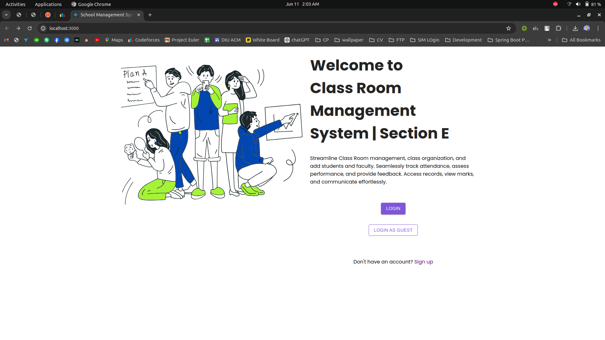
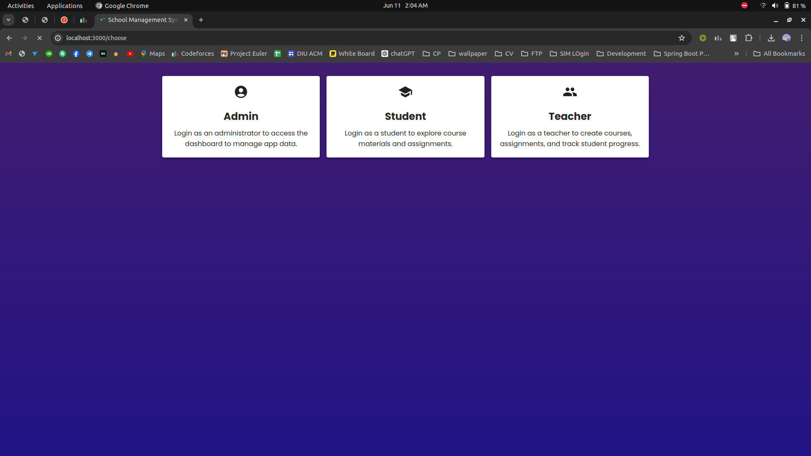
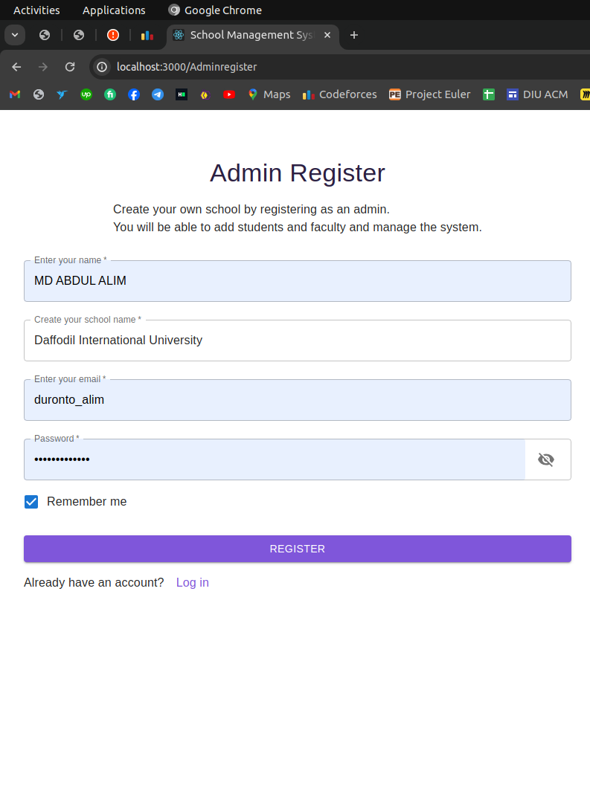
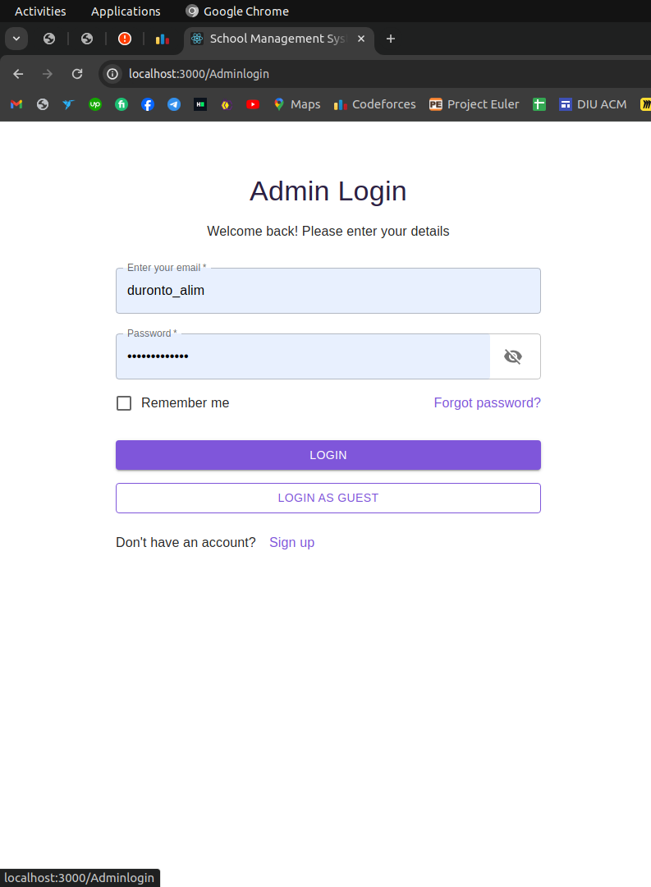
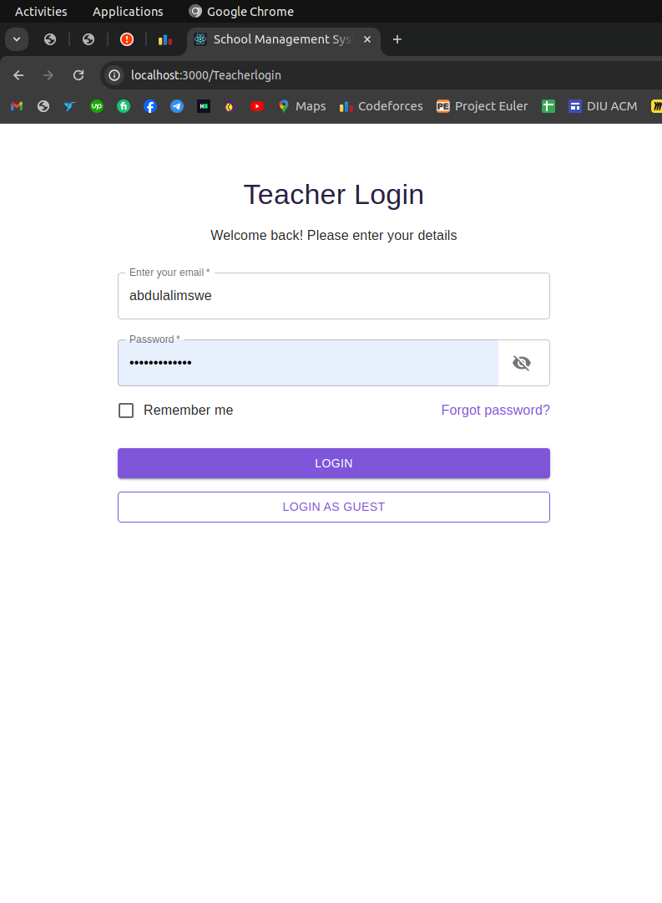
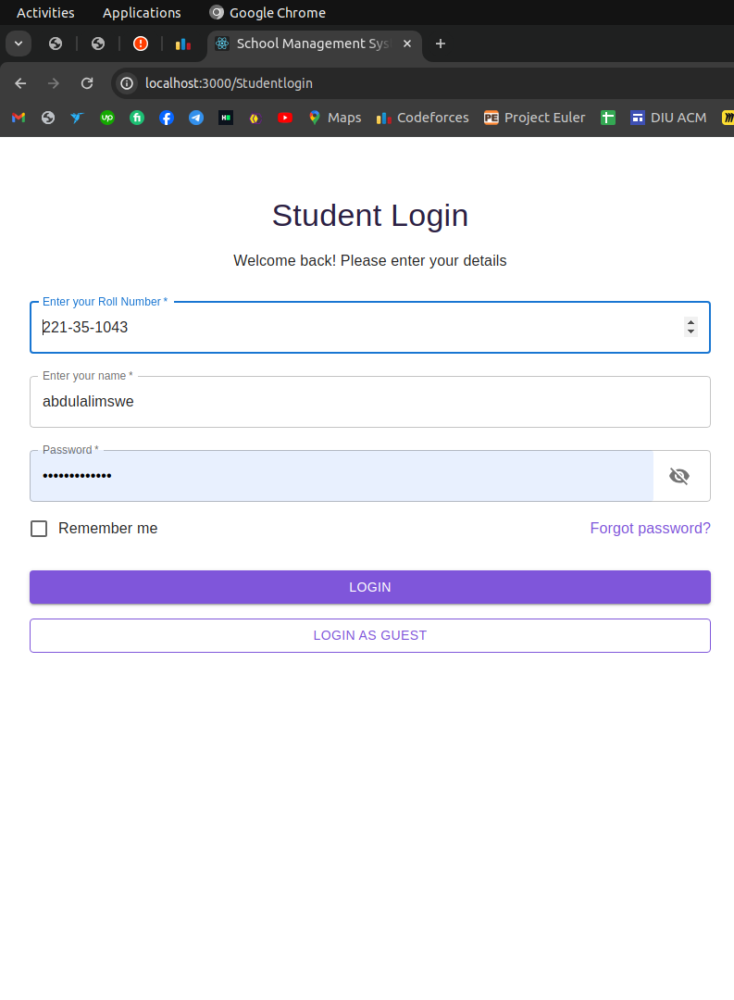
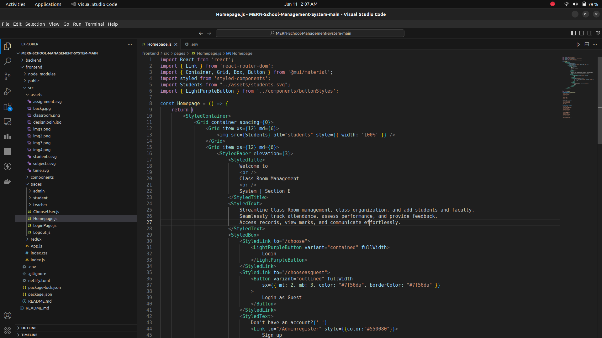

# ClassRoomManagementCapstoneProject

> #### This project aims to develop a digital solution to streamline class management, automate administrative tasks, and enhance communication in educational institutions. Leveraging modern technologies, it ensures efficient operations and optimal learning outcomes.

## Features

- [x] User Management
- [x] Class Administration
- [x] Communication Tools
- [x] Analytics and Reporting
- [x] Security Measures

## Snapshots

### Home

### Login Panel

### Admin Register

### Admin Login

### Teacher Login

### Student Login

### Code Snap

